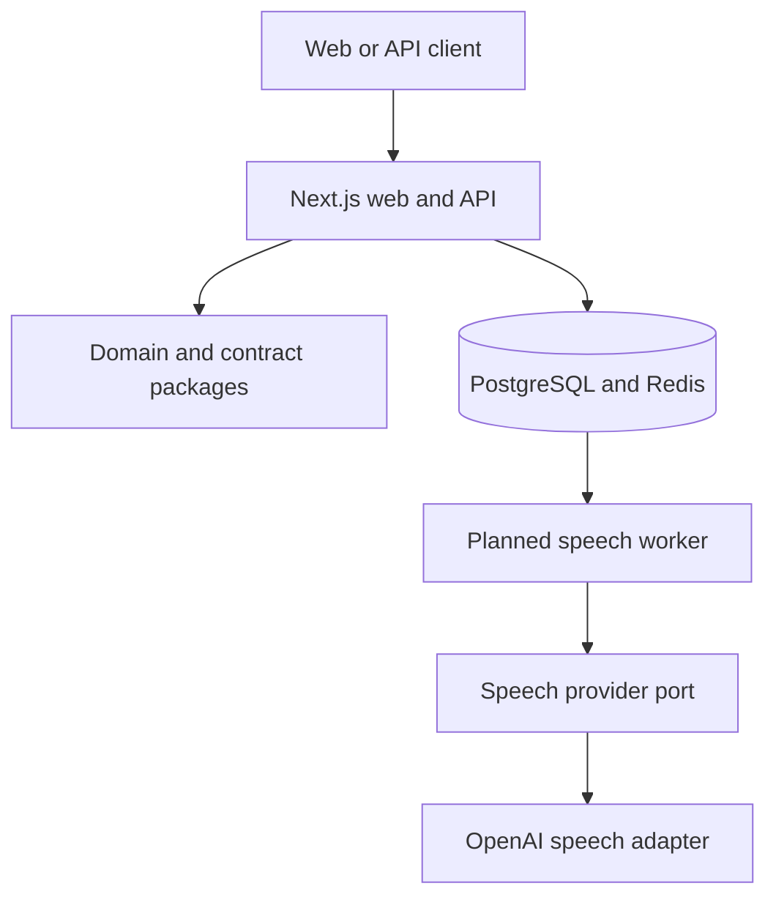

<div align="center">

# Voxora

### Governed voice infrastructure for accessible, multi-tenant products

[](https://github.com/Faramarz-Saidmohammadi/voxora/actions/workflows/ci.yml)


[](LICENSE)

Voxora turns reusable text into governed speech workflows with tenant-aware authorization, usage controls, provider portability, and auditable operations.

</div>

## Why this project exists

Voice features are easy to prototype and difficult to operate responsibly. Voxora demonstrates the engineering controls required between a product interface and a paid speech provider: explicit tenancy, server-side authorization, idempotency, usage reservation, safe provider boundaries, normalized failures, and accessibility-first playback.

The repository is a production-oriented modular monolith. It is intentionally honest about its current maturity: the executable foundation and OpenAI adapter are implemented and tested; persistence, durable dispatch, and production identity remain documented follow-up milestones.

## Engineering signals

| Area         | Implementation                                                                                |
| ------------ | --------------------------------------------------------------------------------------------- |
| Architecture | Next.js App Router, framework-independent domain packages, provider port and adapter          |
| Security     | Server-only secrets, tenant-scoped RBAC, bounded inputs, normalized errors, defensive headers |
| Reliability  | Idempotency contract, usage reservation, correlation IDs, explicit retry metadata             |
| Quality      | Strict TypeScript, ESLint, Prettier, Vitest coverage, Playwright desktop/mobile/API checks    |
| Operations   | Health endpoint, Docker infrastructure, CI gates, ADRs, SRS, API and security documentation   |

## Product capabilities

- Workspace-scoped phrase libraries and voice presets
- `OWNER`, `ADMIN`, `EDITOR`, and `VIEWER` authorization
- Provider-independent speech contracts and OpenAI adapter
- Usage budgets, idempotency, and billing-ready metering
- Accessible local and AI-generated voice previews
- Explicit disclosure before AI-generated playback
- Structured correlation, auditability, and failure handling
- Public health and versioned API routes

## Architecture



The dependency direction is deliberate:

```text
apps/web            Next.js product, API boundaries, and provider configuration
packages/contracts  Runtime-validated public request and response contracts
packages/domain     Tenant authorization, usage, and speech workflow rules
packages/speech     Provider port and contract-tested OpenAI adapter
infra               Local PostgreSQL and Redis services
docs                SRS, architecture, security, API, operations, and ADRs
```

Business rules do not import Next.js, a database client, or the OpenAI SDK. The OpenAI integration is an adapter—not the product architecture.

## Request lifecycle

1. Resolve workspace, actor, role, and idempotency context.
2. Validate the versioned request contract.
3. Enforce `speech:create` server-side.
4. Reserve the workspace character budget.
5. Dispatch through the provider-neutral interface.
6. Return audio with request and correlation identifiers.
7. Normalize provider failures without exposing credentials or upstream bodies.

## Quick start

Requirements: Node.js 24 LTS, npm 11+, and Docker for optional local infrastructure.

```bash
git clone https://github.com/Faramarz-Saidmohammadi/voxora.git
cd voxora
npm install
cp .env.example .env
npm run dev
```

Open:

- `http://localhost:3000` — product overview
- `http://localhost:3000/dashboard` — workspace experience
- `http://localhost:3000/api/health` — service health

Optional infrastructure:

```bash
docker compose up -d
```

## OpenAI speech provider

The default `browser-demo` mode sends no preview text to an external provider. To enable server-side OpenAI speech generation locally, set private environment variables in `.env`:

```bash
SPEECH_PROVIDER=openai
OPENAI_API_KEY=your-project-api-key
OPENAI_SPEECH_MODEL=gpt-4o-mini-tts
```

The integration applies a 30-second request timeout, bounded SDK retries, request cancellation, idempotency metadata, and retry classification. The API key is read only by the server and is never exposed through a `NEXT_PUBLIC_` variable.

> [!CAUTION]
> The current identity headers are an explicit local foundation contract, not production authentication. Do not enable the paid provider on a public deployment until signed sessions or scoped API keys and distributed rate limits are in place.

## API example

```bash
curl http://localhost:3000/api/v1/speech-generation \
  --request POST \
  --header 'Content-Type: application/json' \
  --header 'x-voxora-tenant: workspace-demo' \
  --header 'x-voxora-actor: local-developer' \
  --header 'x-voxora-role: EDITOR' \
  --header 'idempotency-key: preview-001' \
  --data '{
    "text": "Your appointment is confirmed.",
    "locale": "en-US",
    "voice": "cedar",
    "format": "mp3"
  }' \
  --output preview.mp3
```

## Quality gates

```bash
npm run format:check
npm run lint
npm run typecheck
npm run test
npm run build
npm run test:e2e
npm audit --omit=dev
```

Pull requests must pass both CI jobs:

- `quality`: formatting, linting, type-checking, unit tests, coverage, and production build
- `browser`: Chromium installation plus desktop, mobile, and API Playwright checks

## Documentation

- [Software requirements](docs/SRS.md)
- [Architecture](docs/ARCHITECTURE.md)
- [Security model](docs/SECURITY.md)
- [API contract](docs/API.md)
- [Operations guide](docs/OPERATIONS.md)
- [Modular-monolith decision](docs/adr/0001-modular-monolith.md)
- [OpenAI adapter decision](docs/adr/0002-openai-speech-adapter.md)
- [Contributing guide](CONTRIBUTING.md)

## Delivery status

| Capability                                       | Status                                      |
| ------------------------------------------------ | ------------------------------------------- |
| Responsive product and dashboard                 | Implemented and browser-tested              |
| Domain authorization and usage rules             | Implemented and unit-tested                 |
| OpenAI speech adapter                            | Implemented and contract-tested             |
| Synchronous governed preview API                 | Implemented; local foundation identity only |
| PostgreSQL repositories and transactional outbox | Planned                                     |
| Durable Redis worker and reconciliation          | Planned                                     |
| External identity and scoped API keys            | Planned                                     |
| Private object storage and expiring audio URLs   | Planned                                     |

## Attribution

Voxora is designed and engineered by **Faramarz Said Mohammadi**. OpenAI is an optional API provider and is not the author, owner, or maintainer of this project.

## License

Licensed under the [MIT License](LICENSE).
