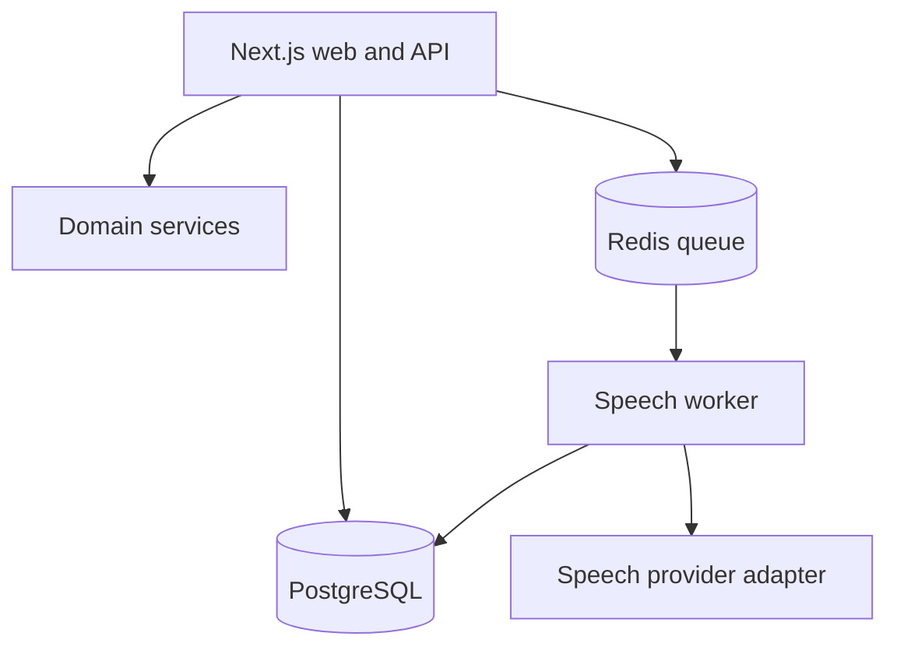

# Architecture

## Context

Voxora accepts speech work from a web product and external API clients. It applies workspace membership, role, idempotency, and usage rules before dispatching vendor work. Long-running synthesis is asynchronous; browser preview remains local to the user's device.

## Deployment model

The repository begins as a modular monolith with one web deployable and a planned worker. Packages define stable boundaries so the worker can be introduced without splitting business rules across services.

## Dependency rules

- `domain` imports no framework, database client, queue, or speech SDK.
- `contracts` owns runtime validation for public boundaries.
- `web` translates HTTP and UI concerns into domain inputs.
- Persistence and provider adapters implement ports owned by the application/domain layer.
- Tenant identity is resolved at the boundary and passed explicitly; no ambient global tenant.

## Critical speech request transaction

1. Resolve authenticated principal and workspace membership.
2. Require `speech:create` permission.
3. Validate the versioned request contract.
4. Acquire or detect the workspace-scoped idempotency key.
5. Atomically reserve character usage and create a queued request.
6. Publish an outbox event for the worker.
7. Return `202 Accepted` with request and correlation identifiers.

The executable foundation implements steps 2–3 and pure rules for steps 4–5. Persistence and outbox adapters are the next milestone.

## Data model

The initial SQL models workspaces, memberships, phrases, speech requests, and audit events. Queries must include `workspace_id`; cross-tenant administrative reporting belongs in a separate privileged path.

## Failure model

- Contract failures: `400` with field-level validation details.
- Authentication failures: `401` without resource disclosure.
- Authorization failures: `403` with a stable code.
- Usage exhaustion: `409` with current limit metadata.
- Provider transient failures: bounded exponential retry.
- Provider terminal failures: normalized failure plus usage reconciliation.
- Duplicate idempotency key: return the existing request, never duplicate work.

## Evolution path

1. Replace demo data with PostgreSQL repositories and signed sessions.
2. Add transactional outbox plus Redis/BullMQ worker.
3. Add provider adapters behind contract tests.
4. Add OIDC, API key rotation, subscription webhooks, and retention jobs.
5. Split deployables only when scaling or ownership data justifies it.
